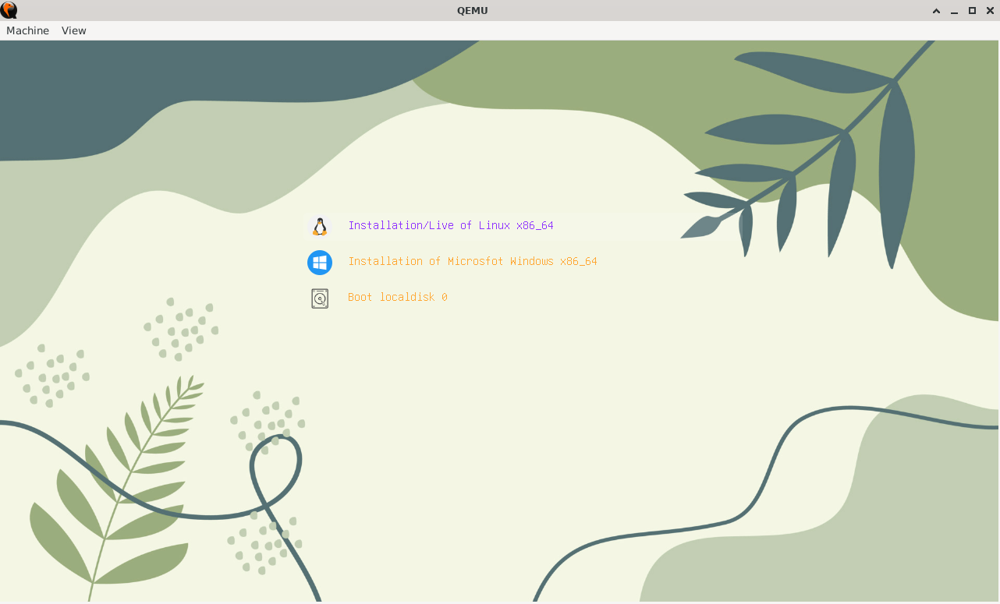

===============================================
Gyoza Multiple OS Live/Installation USB utility
===============================================

Introduction
============

This is a toy project to practice basic shell programming. Just take standard
Linux utilities to create a USB booting device with multiple live/netboot OS
and management ability.

Tools used

* GNU bash
* parted/fdisk/mkfs.fat/losetup/mount
* grub/syslinux/ipxe
* wget/curl
* udisksctl/kernel with 9p shared filesystem
* qemu
* python3/python3 json library/dialog
* optional: wimtools, dialog

Practice
========

::

  # gyoza create test.img
  # gyoza add test.img archlinux
  # gyoza test test.img
  # gyoza theme test.img --select default
  # gyoza test test.img --uefi
  # gyoza import test.img Win10_English_x64.iso
  # gyoza test test.img --uefi

  replace test.img with /dev/sdc for real USB stick

BUILD
=====

::

  $ make         -> will get a shell exeutable 'gyoza' under src
  $ make install -> will install gyoza to /usr/bin/gyoza
  $ make deb     -> will generate deb package under pkgs
  $ make rpm     -> will generate rpm package under pkgs
  $ make docs    -> will generate pdf document if rst2pdf available

Commands Usage
==============

All commands

::

  # gyoza create
  # gyoza download
  # gyoza extract
  # gyoza remenu
  # gyoza update
  # gyzoa add
  # gyoza remove
  # gyoza test
  # gyoza supported
  # gyoza info
  # gyoza import
  # gyoza deport
  # gyoza theme
  # gyoza help

Argv and Options:

::

  # create dev|img [--fs-label mylabel -s size] [distros-info]
  # download dev|img|dir distros-info|url-info
  # extract dev|img|dir distros-info|destdir files-info
  # remenu dev|img|dir [distros-info] [--theme mytheme]
  # update dev|img|dir [distros-info]
  # add dev|img|dir distros-info
  # remove dev|img|dir distros-info
  # test dev|img
  # info dev|img
  # import dev|img|dir esxi6-8-iso[:import-path]|windows7-11-iso[:import-path]|msdos-img 
  # deport dev|img|dir import-path
  # theme dev|img theme-dir [-add|--select|--delete]

Default Values:

::

  # theme=
  # size=8G
  # fs-label=GYOZA
  # esxi-path=/esxi/{6.x,7.x,8.x, ...}
  # windows-path=/windows/{1,2,3 ...}
  # dos-path=/dos

OS supported
============

For liveiso type, it's just a live DVD from distribution and tries to give user
a glimpse of looks and feels while netboot type distributions usually are the
essential usage such as server or security emphasized distribution.

* Linux

  - almalinux

  - archlinux

  - debian

  - endeavouros

  - fedora

  - kali

  - kubuntu

  - linuxmint

  - mageia

  - manjaro

  - mx

  - opensuse

  - pearl

  - rocky

  - steamos

  - ubuntu

* BSD

  - netbsd

  - openbsd

* SystemV

  - omnios community edition

* DOS

 - freedos from freedos.org

 - DOS disk raw image file

* ESXi

  - esxi offical ISO

* MS-Windows

  - Mircosoft offical ISO

Check gyoza supported for more details

Screenshot
==========

